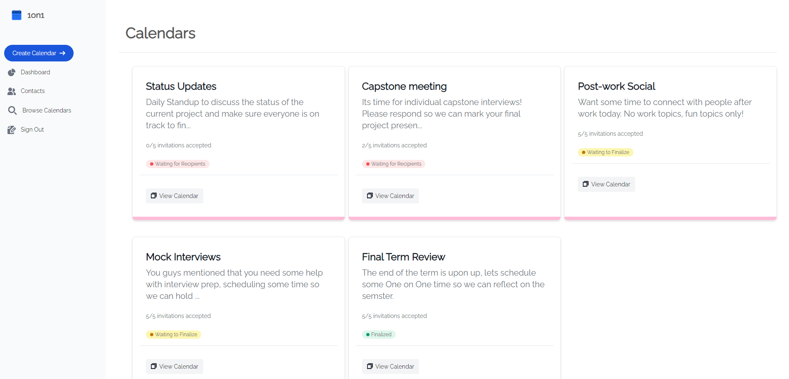
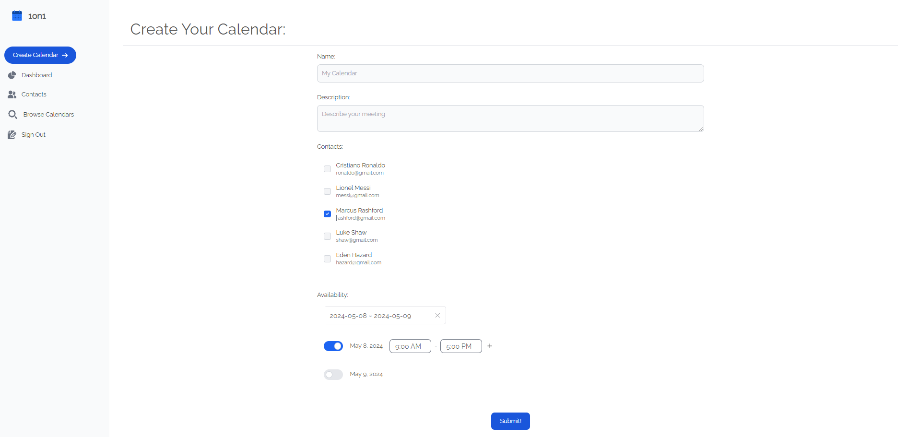
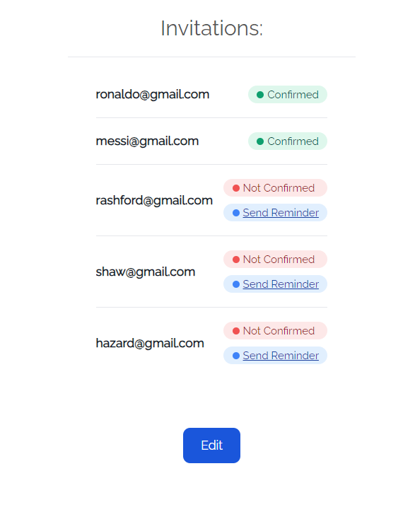
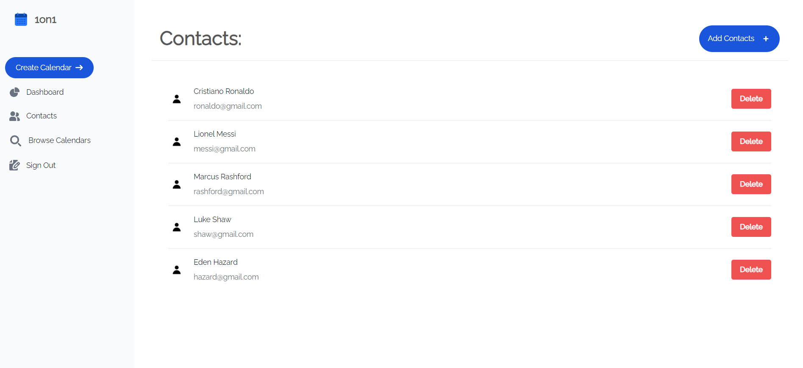

<!-- Improved compatibility of back to top link: See: https://github.com/othneildrew/Best-README-Template/pull/73 -->
<a name="readme-top"></a>


<!-- PROJECT LOGO -->
<br />
<div align="center">
  <a href="https://github.com/ikrambil/OneOnOne">
    
  </a>

<h3 align="center">OneOnOne</h3>

  <p align="center">
    A Calendly-inspired application engineered to streamline the scheduling of multiple meetings simultaneously, enhancing efficiency and coordination.
</div>


<!-- TABLE OF CONTENTS -->
<details>
  <summary>Table of Contents</summary>
  <ol>
    <li>
      <a href="#about-the-project">About The Project</a>
      <ul>
        <li><a href="#built-with">Built With</a></li>
      </ul>
    </li>
    <li>
      <a href="#getting-started">Getting Started</a>
      <ul>
        <li><a href="#prerequisites">Prerequisites</a></li>
        <li><a href="#installation">Installation</a></li>
      </ul>
    </li>
    <li><a href="#license">License</a></li>
    <li><a href="#contact">Contact</a></li>
  </ol>
</details>


<!-- ABOUT THE PROJECT -->
## About The Project

<div style="display: flex; justify-content: center; align-items: center; margin-top: 40px; margin-bottom: 40px;">
  
</div>


<p> 

OneOnOne introduces a scheduling platform inspired by Calendly, designed to simplify the coordination of meetings and events across various users. At its core, the application allows individuals to create calendar events and specify their availability. Users can then invite others to contribute their own availability, facilitating an efficient consensus on meeting times that work for everyone. This system is particularly useful for professionals who manage multiple meetings or for social groups planning events. It streamlines the process, and allows users to schedule everything in one place.

Beyond basic scheduling, the platform offers several advanced features to enhance user experience. Each event can be managed through multiple editable calendars, allowing participants to visualize alternatives and finalize schedules. The app includes an email reminder system to ensure participants are aware of upcoming commitments. Additionally, it allows for reviewing and modifying existing calendars, ensuring flexibility and adaptability to changing schedules. Through its user-friendly interface and powerful functionality, this application aims to streamline the process of event coordination, making it more efficient and less time-consuming for all involved.
</p>

<p align="right">(<a href="#readme-top">back to top</a>)</p>


### Built With

* [![React][React-badge]][React-url]
* [![TailwindCSS][TailwindCSS-badge]][TailwindCSS-url]
* [![Django][Django-badge]][Django-url]
* [![SQLite][SQLite-badge]][SQLite-url]

<p align="right">(<a href="#readme-top">back to top</a>)</p>

## Additional Screenshots

<div style="display: flex; flex-direction: column;  justify-content: center; align-items: center; margin-top: 40px; margin-bottom: 40px;">
  
  
  

</div>

<!-- GETTING STARTED -->
## Getting Started

If you want to setup a local instance of the project feel free to do so with the following steps:

### Prerequisites

Please install the following:
* npm
  ```sh
  npm install npm@latest -g
  ```
* python
  ```sh
  sudo apt instll python3.8
  ```

### Installation

1. Clone the repo
   ```sh
   git clone https://github.com/github_username/repo_name.git
   ```
2. Setup Django Server
   ```sh
   cd backend
   pip install -r requirements.txt
   python manage.py migrate
   python manage.py runserver
   ```
3. Setup React Server
   ```sh
   cd front-end
   npm install
   npm start
   ```
4. The app will be available at http://localhost:3000/

<p align="right">(<a href="#readme-top">back to top</a>)</p>


<!-- LICENSE -->
## License

Distributed under the MIT License. See `LICENSE.txt` for more information.

<p align="right">(<a href="#readme-top">back to top</a>)</p>


<!-- CONTACT -->
## Contact

Your Name  - bilal.ikr@outlook.com

Project Link: [https://github.com/ikrambil/OneOnOne](https://github.com/ikrambil/OneOnOne)

<p align="right">(<a href="#readme-top">back to top</a>)</p>


<!-- MARKDOWN LINKS & IMAGES -->
<!-- https://www.markdownguide.org/basic-syntax/#reference-style-links -->
[contributors-shield]: https://img.shields.io/github/contributors/github_username/repo_name.svg?style=for-the-badge
[contributors-url]: https://github.com/github_username/repo_name/graphs/contributors
[forks-shield]: https://img.shields.io/github/forks/github_username/repo_name.svg?style=for-the-badge
[forks-url]: https://github.com/github_username/repo_name/network/members
[stars-shield]: https://img.shields.io/github/stars/github_username/repo_name.svg?style=for-the-badge
[stars-url]: https://github.com/github_username/repo_name/stargazers
[issues-shield]: https://img.shields.io/github/issues/github_username/repo_name.svg?style=for-the-badge
[issues-url]: https://github.com/github_username/repo_name/issues
[license-shield]: https://img.shields.io/github/license/github_username/repo_name.svg?style=for-the-badge
[license-url]: https://github.com/github_username/repo_name/blob/master/LICENSE.txt
[linkedin-shield]: https://img.shields.io/badge/-LinkedIn-black.svg?style=for-the-badge&logo=linkedin&colorB=555
[linkedin-url]: https://linkedin.com/in/linkedin_username
[product-screenshot]: images/screenshot.png
[Next.js]: https://img.shields.io/badge/next.js-000000?style=for-the-badge&logo=nextdotjs&logoColor=white
[Next-url]: https://nextjs.org/
[React.js]: https://img.shields.io/badge/React-20232A?style=for-the-badge&logo=react&logoColor=61DAFB
[React-url]: https://reactjs.org/
[Vue.js]: https://img.shields.io/badge/Vue.js-35495E?style=for-the-badge&logo=vuedotjs&logoColor=4FC08D
[Vue-url]: https://vuejs.org/
[Angular.io]: https://img.shields.io/badge/Angular-DD0031?style=for-the-badge&logo=angular&logoColor=white
[Angular-url]: https://angular.io/
[Svelte.dev]: https://img.shields.io/badge/Svelte-4A4A55?style=for-the-badge&logo=svelte&logoColor=FF3E00
[Svelte-url]: https://svelte.dev/
[Laravel.com]: https://img.shields.io/badge/Laravel-FF2D20?style=for-the-badge&logo=laravel&logoColor=white
[Laravel-url]: https://laravel.com
[Bootstrap.com]: https://img.shields.io/badge/Bootstrap-563D7C?style=for-the-badge&logo=bootstrap&logoColor=white
[Bootstrap-url]: https://getbootstrap.com
[JQuery.com]: https://img.shields.io/badge/jQuery-0769AD?style=for-the-badge&logo=jquery&logoColor=white
[JQuery-url]: https://jquery.com 
[React-badge]: https://img.shields.io/badge/React-20232A?style=for-the-badge&logo=react&logoColor=61DAFB
[React-url]: https://reactjs.org/
[TailwindCSS-badge]: https://img.shields.io/badge/Tailwind_CSS-38B2AC?style=for-the-badge&logo=tailwind-css&logoColor=white
[TailwindCSS-url]: https://tailwindcss.com/
[Django-badge]: https://img.shields.io/badge/Django-092E20?style=for-the-badge&logo=django&logoColor=green
[Django-url]: https://www.djangoproject.com/
[SQLite-badge]: https://img.shields.io/badge/SQLite-07405E?style=for-the-badge&logo=sqlite&logoColor=white
[SQLite-url]: https://sqlite.org/